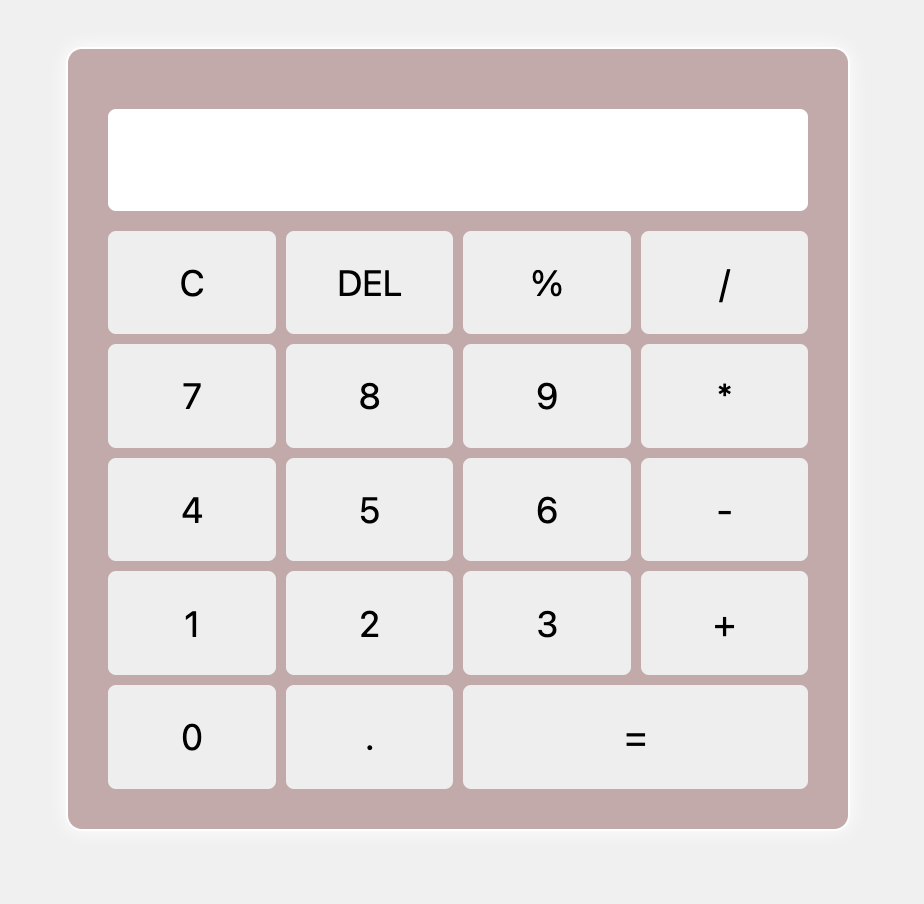

# About

The goal is to build a solid foundation in Javascript by developing small project ideas.

# Project 1: Simple Calculator

This project involves building a basic calculator capable of performing addition, subtraction, multiplication, and division. The primary learning objectives are handling user input, performing arithmetic operations and converting data types efficiently.

## Key Concepts

- Event handling (button clicks)
- Data type conversion (String to Number)
- Arithmetic operations
- Update the UI dynamically

# Project 2: Cooking Recepies

## Key Concepts

# Project 3: Weather App
